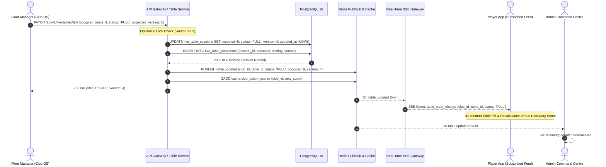
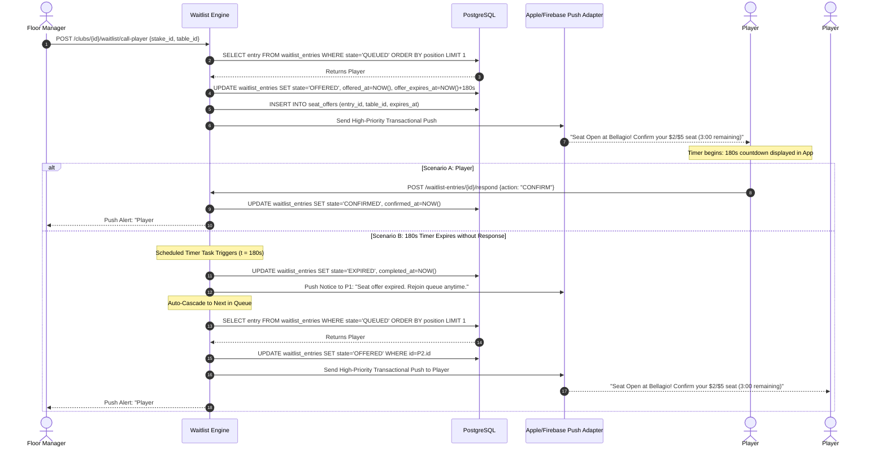
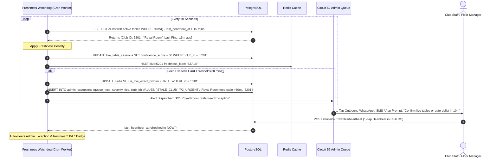
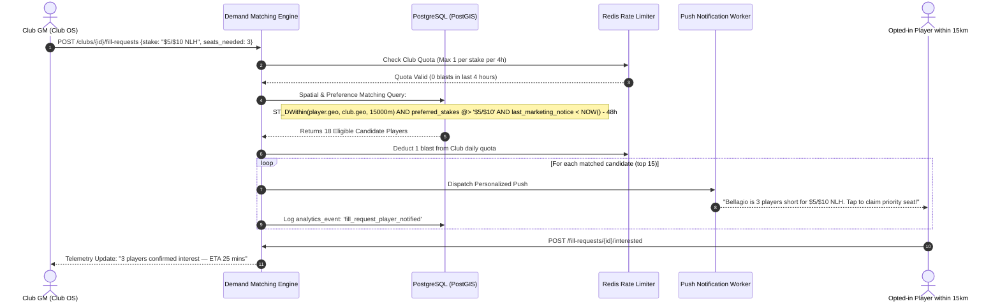
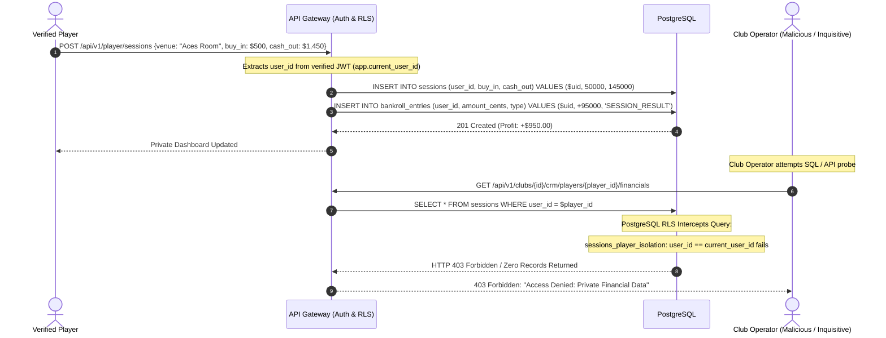

# Circuit 52 — Architecture Sequence Diagrams

This document formalizes the critical operational and real-time workflows of Circuit 52 using standard Mermaid sequence diagrams.

---

## 1. Live Table State Mutation & Zero-Latency Player Fanout

Illustrates the flow when a floor manager updates table occupancy or status via the 3-click Club OS console, propagating to thousands of subscribed mobile players in $< 1$ second via Server-Sent Events (SSE).

---

## 2. Waitlist Lifecycle & 180-Second Seat Offer Auto-Cascade

Shows how a seat vacancy triggers an automated offer to Queue Position #1, starts a synchronized countdown timer, and automatically cascades to Queue Position #2 if the timer expires or the offer is declined.

---

## 3. Stale Data Decay, Public Demotion & Admin Auto-Exception Loop

Visualizes the background heartbeat decay algorithm that protects the "Live Truth" principle by automatically penalizing stale feeds and dispatching an incident to the Circuit 52 Admin Exception Queue.

---

## 4. "Fill My Table" Demand Engine Matching & Rate Limiting

Demonstrates how a club with a short-handed table matches opted-in players within a geographic radius without violating notification caps.

---

## 5. Player Private Session & Bankroll Invariant (Zero-Knowledge Isolation)

Confirms the cryptographic and architectural isolation of private player performance data from clubs and third parties.

